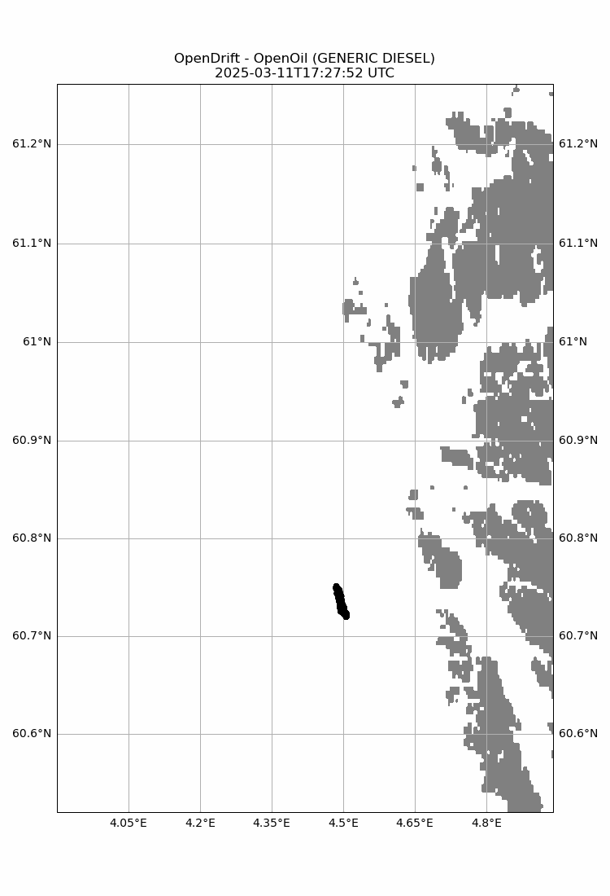
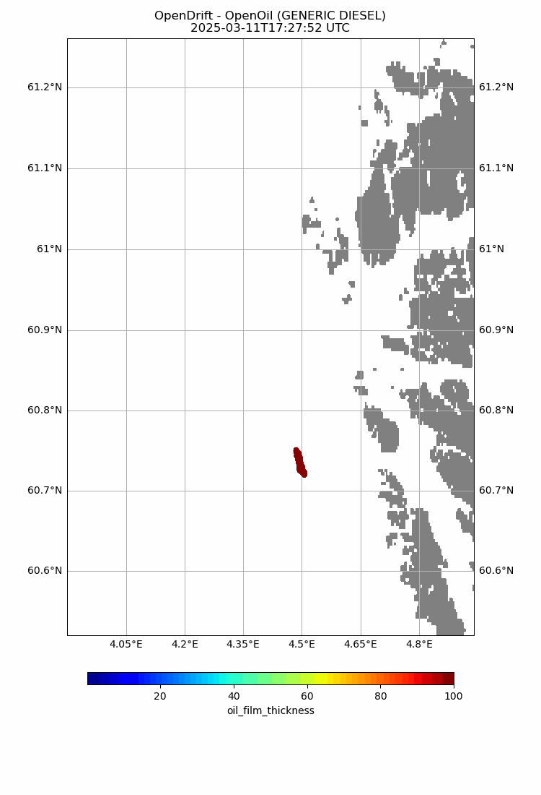
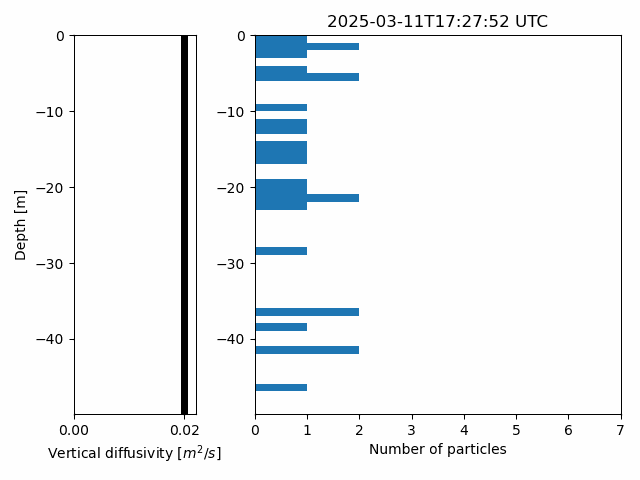
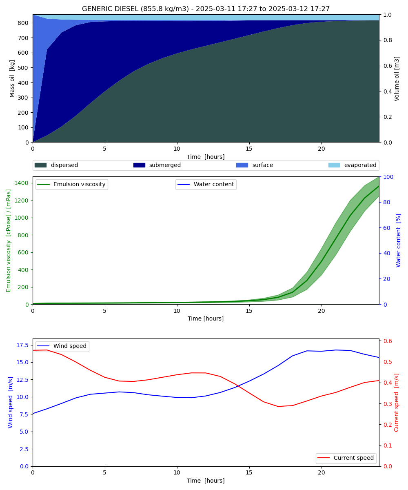

# Oil Spill Simulation

Forecasting where a satellite-detected oil slick goes next, using open data and
[OpenDrift](https://opendrift.github.io).

<p align="center">
  
</p>

## Overview

Satellite systems such as [SkyTruth Cerulean](https://cerulean.skytruth.org) detect oil slicks
in near real time, but a detection is only a snapshot, while a response team needs to know where
the oil will go. This project seeds a slick detected off the Norwegian coast on 11 March 2025 into
OpenDrift's OpenOil model and forecasts its drift and weathering over the next 24 hours.

| Step           | Data or tool                                                                 |
| -------------- | ---------------------------------------------------------------------------- |
| Detection      | SkyTruth Cerulean (Sentinel-1 SAR and machine learning), through its API    |
| Oil type       | GENERIC DIESEL from the NOAA ADIOS oil database                              |
| Ocean currents | HYCOM surface currents, 11 to 15 March 2025 (included in `data/`)            |
| Wind           | NOAA GFS 10 m wind, streamed from the PacIOOS THREDDS server                 |
| Model          | OpenDrift OpenOil, 10,000 elements, 10-minute time step, 24 hours            |

## Results

Over 24 hours the slick drifts about 34 km north-northwest. The oil stays at the surface for the
first hours and is then mixed into the water column; by the end most of it is dispersed or
submerged down to about 50 m, and only a small fraction (about 4 to 8% across runs) has
evaporated.
Vertical mixing is random, so the exact numbers change slightly from run to run.

| Oil film thickness | Vertical distribution |
| :---: | :---: |
|  |  |

<p align="center">
  
</p>

The notebook also animates the slick over the current (`results/currents.gif`) and wind
(`results/wind.gif`) fields.

## Repository Structure

```
oil_spill_simulation.ipynb           detection, preprocessing, simulation and plots
data/
  slick_norway_2025-03-11.geojson    Cerulean detection of the slick
  hycom_norway_2025-03.nc4           HYCOM surface fields around the slick
results/                             animations and figures written by the notebook
environment.yml
```

## Usage

```bash
conda env create -f environment.yml
conda activate oil_spill_simulation
jupyter lab oil_spill_simulation.ipynb
```

The notebook needs internet access for the Cerulean API, the NOAA wind data and the coastline
map. It was run with OpenDrift 1.13.1.

## Limitations

- No wave data (Stokes drift, wave height), so OpenDrift uses its fallback values.
- No follow-up satellite image was available to validate the forecast.
- The oil type is assumed, and only the first polygon of the detection is seeded.

## Paper

The workflow is described in the seminar paper *Integrating Satellite Detection and Lagrangian
Drift Modeling for Oil Spill Forecasting* (2025).

## Acknowledgements

Built on [OpenDrift](https://github.com/OpenDrift/opendrift) (Dagestad et al., 2018,
*Geoscientific Model Development* 11, 1405–1420). Slick detection from SkyTruth Cerulean, ocean
currents from HYCOM, and wind from NOAA GFS through PacIOOS.

## License

Code under the [MIT License](LICENSE). The input data belongs to its providers.
